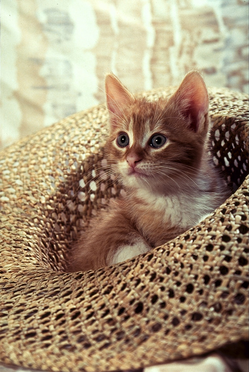

# Cooling Effect
Here we are with another filter effect **Cooling Effect**.<br>
In this session you will know about how to utilize and build *lookup_table*,splitting RGB channels,<br>
applying mapping to channels & merging channels.<br>
As we are manipulating warming effect hecnce we have to work with Only red & blue channels,<br>
we don't need to distort green channel.<br>
This is an important project to sharpen your skills on openCV.<br>
## Tools and Languages:<br>


<br>


## Installation
Use the package manager [pip](https://pip.pypa.io/en/stable/) to install cv2 and numpy.


```cmd
pip install cv2
pip install numpy
```

## Import
Use [import](https://www.w3schools.com/python/ref_keyword_import.asp) keyword to import modules.

```python
import cv2
import numpy as np
from scipy.interpolate import UnivariateSpline
```

## Reading image from file

```python
img = cv2.imread("cat.png")
```

## Steps to be followed:
1.First create a copy of the image to work on.<br>
2.Set original x & y-axis values.<br>
3.Create and set Lookup Table of both channels.<br>
4.Split the channels.<br>
5.Apply Lookuptable-mapping into both channels.<br>
6.For desired output merge the channels. 

## Step-1:
Class for cooling effect 
```python
class CoolingFilter():
```
## Step-2:
Initialize look-up table for curve filter
```python
def __init__(self):
        # create look-up tables for increasing and decreasing a channel
        self.incr_ch_lut = self._create_LUT_8UC1([0, 64, 128, 192, 256],
                                                 [0, 70, 140, 210, 256])
        self.decr_ch_lut = self._create_LUT_8UC1([0, 64, 128, 192, 256],
                                                 [0, 30,  80, 120, 192])
```
## Step-3:
```python
def render(self, img_rgb):
        c_r, c_g, c_b = cv2.split(img_rgb)
        c_r = cv2.LUT(c_r, self.incr_ch_lut).astype(np.uint8)
        c_b = cv2.LUT(c_b, self.decr_ch_lut).astype(np.uint8)
        img_rgb = cv2.merge((c_r, c_g, c_b))


       
        c_h, c_s, c_v = cv2.split(cv2.cvtColor(img_rgb, cv2.COLOR_RGB2HSV))
        c_s = cv2.LUT(c_s, self.incr_ch_lut).astype(np.uint8)

        return cv2.cvtColor(cv2.merge((c_h, c_s, c_v)), cv2.COLOR_HSV2RGB)
```     
## Step-4:
```python
def _create_LUT_8UC1(self, x, y):
        """Creates a look-up table using scipy's spline interpolation"""
        spl = UnivariateSpline(x, y)
        return spl(range(256))
```
## Step-5:
```python
#apply mapping to red channel
y = CoolingFilter()
Cool = y.render(img)

#comparing original vs resized
cv2.imshow('ORIGINAL',img)
cv2.imshow('C
```
## Step-6:
```python
cv2.waitKey(0)
cv2.destroyAllWindows()
```

## Images
<p align="center">
	
	
</p>

### Developed by
 [Ashish ku. Behera](https://github.com/ashish-max "Github Id")
